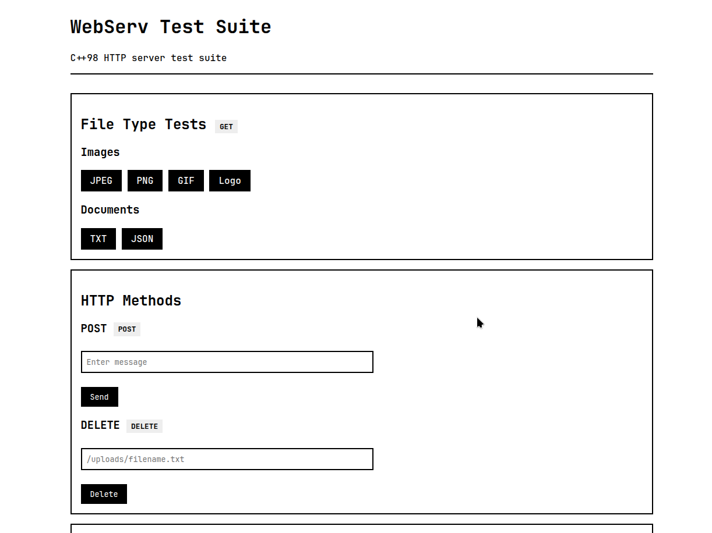

# 🌐 Webserv
### A lightweight HTTP/1.1 Server in C++98

---

## 📝 Overview

A simple HTTP/1.1 web server written in C++98 that handles `GET`, `POST`, and `DELETE` requests.  
It supports `file serving`, `CGI execution`, `cookies`, `sessions`, and `virtual host configuration`.  
Connections are managed using **epoll** for non-blocking I/O with high concurrency.

---



---

## ✨ Features

- ⚡ **Concurrent Client Handling**  
  Supports tens of thousands of clients with `O(1)` time complexity using `epoll`.

- 🌍 **Full HTTP/1.1 Support**  
  Keep-alive, chunked transfer, multipart uploads, and request parsing.

- 🗂️ **File & Directory Serving**  
  Static files, directory listings, and default index resolution.

- 🧩 **CGI Execution**  
  Multi-language CGI support with timeout and error handling.

- 🍪 **Session & Cookie Management**  
  Track and persist user sessions using cookies.

- 🏷️ **Virtual Host Support**  
  Serve multiple hosts on a single IP:Port combo.

- 📁 **Flexible Location Configs**  
  Per-location settings like root paths, methods, redirects, and CGI.

- ⚙️ **Custom Config File Format**  
  Easily define server behavior with a simple `.conf` file.

- ❌ **Auto-generated Error Pages**  
  Built-in error page generation if none is defined.

---

## 🚀 How to Run

```bash
git clone https://github.com/alecmalloc/webserv.git
cd webserv
make
./webserv conf/default.conf
```

---

## ⚙️ Config File Setup

<details>
<summary>🛠️ Click to expand</summary>

# Server blocks:
* listen										127.0.0.1:8080;                 # IP:Port
* server_name							localhost;                      # Hostname
* error_page								404 error_page/404.html;    # Custom error pages
* client_max_body_size			1g;                             # Max request size
* root                   ./;                             # Root directory
* index                  assets/index.html;              # Default index
* autoindex              on;                             # Directory listing
* use_chunked_encoding   on;                             # Allow chunked transfer
* chunk_size             1m;                             # Chunk size
* allowed_redirects      301 www.google.com;             # Global redirect
 
# Location blocks:
* location /upload {
*     allowed_methods       GET POST DELETE; #allowed Methods
*     allowed_redirects     302 www.google.com; #location redirect
*     root                  ./uploads; #location root dir
*     autoindex             on; #location specific
*     index                 index.html; #location specific
*     cgi_ext               .py .pl; #allowed cgi scripts
*     cgi_path              /usr/bin/python3 /usr/bin/perl; #cgi executables
*     upload_dir            uploads; #upload directory
*     client_max_body_size  5m; #location specific
* }

</details>

---

## 📁 Project Structure

```plaintext
webserv/
├── src/                 → C++ source code
│   ├── Cgi/             → CGI logic
│   ├── Config/          → .conf file parsing
│   ├── Http/            → Request parsing
│   ├── Response/        → Response handling
│   ├── Server/          → Server loop & init
│   └── main.cpp
├── inc/                 → Header files
├── server/
│   ├── assets/          → Test files (images, PDFs, etc.)
│   ├── cgi-bin/         → CGI scripts (Python, Perl)
│   │   └── uploads/     → Uploads from CGI
│   ├── error_page/      → Custom error HTML pages
│   ├── html/            → Static web pages
│   └── uploads/         → Default upload target
├── conf/                → Example config files
├── Makefile
└── README.md
```

---

## 👨‍💻 Authors

- [@alecmalloc](https://github.com/alecmalloc)
- [@eschencode](https://github.com/eschencode)
- [@bartsch-tech](https://github.com/bartsch-tech)
